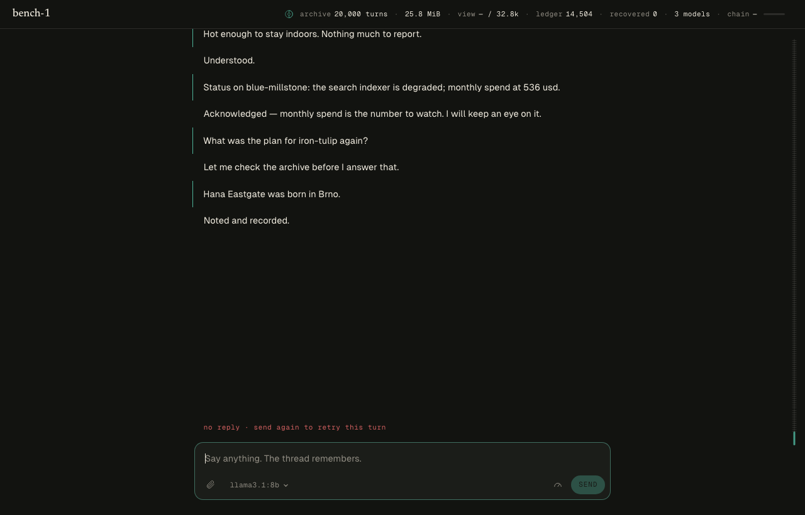

<p align="center"></p>
<h1 align="center">Pylos</h1>
<p align="center"><strong>The forever chat.</strong> One conversation. Every model. Nothing forgotten silently.</p>
<p align="center"><a href="https://pylos.vercel.app">pylos.vercel.app</a> · <a href="docs/VISION.md">Vision</a> · <a href="docs/KERNEL.md">Kernel</a> · <a href="docs/THEORY.md">Theory</a> · <a href="docs/DESIGN.md">Design</a> · <a href="bench/results/">Proofs</a></p>

Pylos is a chat app with a single text box and a single conversation that does not end. It is local-first: install it, run `pylos serve`, and open `http://127.0.0.1:7334/app/` — the desktop app (macOS, Linux) wraps the same experience without a terminal. `pylos serve --hosted` turns the identical binary into a multi-user server for anyone who wants to run their own; Pylos does not operate a hosted deployment. Underneath it: an exact, hash-chained archive of every turn; a context compiler that hands the current model a **fixed-budget view**; a **loss ledger** that records, deterministically, what each compaction step dropped and never lets that record disappear; and **exact paging** that brings the original material back before the model answers. Models are temporary cognition. The thread is the agent.

Before installing anything, [**the impossible thread**](https://pylos.vercel.app/#console) on the landing page runs the real kernel over the bench's own 1,000,000-turn corpus in your browser — no sign-in, no model call.

> The tablets survived because the palace burned.

<p align="center"></p>

## What is measured (deterministic), what is sampled (live) — and what is not

| Claim | Evidence |
| --- | --- |
| The view stays bounded while the archive grows without bound | `bench/results/million-3.md` (kernel 1.2.0; `million-2.md` is the 1.1.0 run, `million-1.md` the 1.0.0 run): 1,000,000 turns; the hard cap of 8,192 tokens held at every checkpoint (max observed 8,080) while recovery stayed exact over a 1,054 MiB archive, 676,593 ledger entries, 35,713 capsules. (`bench/results/million-1.md` is the v1.0.0 artifact, kept for the record.) |
| What was compacted away is recoverable, exactly | same run: 200/200 planted quotes paged back byte-exact; 50/50 planted numbers present in the packet after compile with unit agreement (ledger-routing precision 1.00 at 1,000,000, from `routing.precision`); 2,000/2,000 revised-fact packets contained the current value (all by paging at 1M) and never a stale certificate — historical reachability is asserted for the rule, not for every fact |
| The ledger is conserved and complete; the chain verifies | same run: conservation + completeness recomputed from episodes (sampled at each checkpoint, exhaustive at 1,000,000); `verify()` ok to #1,000,000 |
| Any turn can be addressed by its number, at any archive size | same run: 100 turn-number probes per checkpoint, resolved by an explicit page under a `sequence` page record — **10,000/10,000** byte-exact across the run; at the last checkpoint the draw is replaced for turn 1 and turn 345, asked for by name on the 1,000,000th turn. 200 of those 10,000 queries also carried pages for names in the previous reply — a second, unrelated route (§5.1) that fires on the same turn; that is by design, not noise |
| A memory the ledger never recorded is still reachable by meaning, when the words overlap | same run: 2,000 planted name-free sentences, 0 ledger rows — **2,000/2,000** recovered by stemmed lexical search. Proves that a deterministic stemmed lexical search returns the exact episode when the question shares four content words with it and no name route resolved; proves nothing about paraphrase, about questions that also name something the ledger knows, or about precision on real conversation; these losses were invisible to the ledger by construction |
| The assistant proposes; only the user authorizes | same run, three poison variants: **A** (user first, assistant later restates it wrongly) 100/100; **B** (only the assistant ever claimed it) 50/50; **C** (user corrects the assistant's wrong restatement) 50/50 — the user's value always holds the slot, the assistant's is never a certificate. 151 atoms stood `PROPOSED` at 1,000,000 |
| In one live sample, a model answering from a Pylos packet did not state a stale value as current | `bench/results/million-live-live-1.md` (measured on kernel 1.0.0; one model, one seed, grok-4.3, 36 probes/arm): Pylos 36/36 current, 0 silent-false; chronological rolling summary 5/36 current, 29 abstentions, 2 silent-false. The model never called `recall` — every answer came from the compiled packet. The trap: Pylos's packet carried the revised rule as a *resident* certificate with the turn-1 version listed as historical (a frontier mechanism the baseline lacks; no page was needed) and the model honoured it; the summary carried only the stale rule |
| The thread survives the machine | `bench/results/laptop-funeral.md` (measured on kernel 1.0.0; 1,999-episode vault, 0.26 MiB bundle): export → clean profile → import → identical head hash, chain verified |
| A different model can continue the same thread from the compiled packet alone | `bench/results/brain-transplant.md` (measured on kernel 1.0.0): a short thread, Grok → local `qwen3:4b` mid-thread through the shipping sidecar; no provider session reused |
| Every provider request in a turn is bounded and receipted, not just the compiled packet | `packages/core/test/turn.test.ts` (KERNEL A10.3) — this is a test, not a bench: it asserts every `Packet.rounds[i].tokens ≤ budget` and that `roundsDigest` recomputes from the stored rounds; no run-scale number is claimed from it |

Not claimed: that a model cannot still be wrong; that a reply has been fact-checked; any natural-conversation benchmark we have not run; "never forgets" (Pylos forgets only on command, and records that it did). See `docs/THEORY.md` §"what we are not claiming".

## Run it

```bash
bun install
bun run --cwd apps/app build && bun packages/core/src/cli.ts serve   # local, open http://127.0.0.1:7334/app/
# self-hosted (multi-user, one vault per signed-in xAI account; not run by us):
pylos serve --hosted --origin https://your-domain --web apps/app/dist
# or the desktop shell:
bun run --cwd packages/server build:sidecar      # kernel + server → one binary for the Tauri sidecar
bun run --cwd apps/desktop tauri dev             # the app (starts the sidecar; first Rust build takes a while)
# or headless, no UI:
bun packages/core/src/cli.ts serve               # local API on 127.0.0.1:7334
bun packages/core/src/cli.ts bench million --turns 100000 --seed 1 --budget 8192
```

Connect xAI on first send (API key, device sign-in, or import your Grok CLI login); Anthropic / OpenAI keys and local Ollama models appear in the model chip. Credentials live in `~/.pylos/auth.json` (0600) and never enter the vault or an export.

Release builds: `.dmg` (Apple Silicon) and `.AppImage`/`.deb` from the [releases page](https://github.com/jack-chaudier/pylos/releases), built by `.github/workflows/release.yml`.

## Layout

```
packages/protocol   shared types + the local API contract
packages/core       the kernel (bun:sqlite) · src/pure is browser-safe and powers the landing page's aperture
packages/server     local API, providers, auth custody, OpenAI-compatible gateway
apps/app            the React app (served at /app/ by the server; wrapped by the desktop shell)
apps/desktop        Tauri 2 + React (the one-composer app)
apps/web            the landing page (Vite, static, Vercel)
bench/              the million-turn bench, the live variant, and results
docs/               VISION · KERNEL (contract) · THEORY (results → mechanisms) · DESIGN · PLAN
```

## Lineage

Pylos starts fresh but stands on [`revelation`](https://github.com/jack-chaudier/revelation), [`stark`](https://github.com/jack-chaudier/stark), [`epistemic-debt`](https://github.com/jack-chaudier/epistemic-debt), and [`revelation-context`](https://github.com/jack-chaudier/revelation-context). `DREAM.md` is the audit that seeded it.

Apache-2.0.
